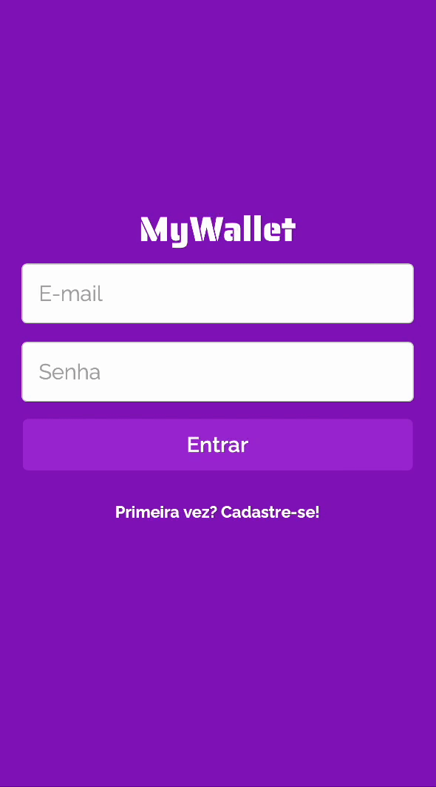

# MyWallet

Design of a wallet manager application (for mobile) ! With the right to register, login and many libraries !



Try it out now at https://my-wallet-front-jao45gg.vercel.app

## About

This is the Front-end of an web application for mobile where lots of people can manage their money. Below are the implemented features:

- Sign Up
- Login
- List all money that goes in and out for a user
- Add input of money
- Add output of money

By using this app any user can keep track of their money !

## Technologies
The following tools and frameworks were used in the construction of the project:<br>
<p>
  
  
  
  
  
  
  
  
  
  
  
</p>

## How to run

1. Clone this repository
2. Install dependencies
```bash
npm i
```
3. Run the front-end with
```bash
npm start
```
4. You can optionally build the project running
```bash
npm run build
```
5. Finally access http://localhost:3000 on your favorite browser (unless it is Internet Explorer. In this case, review your life decisions)g
